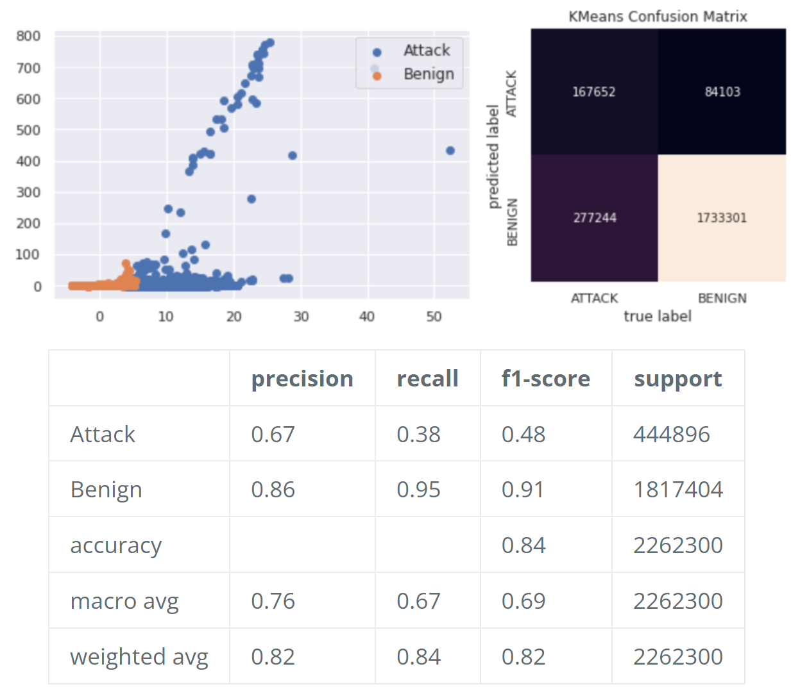
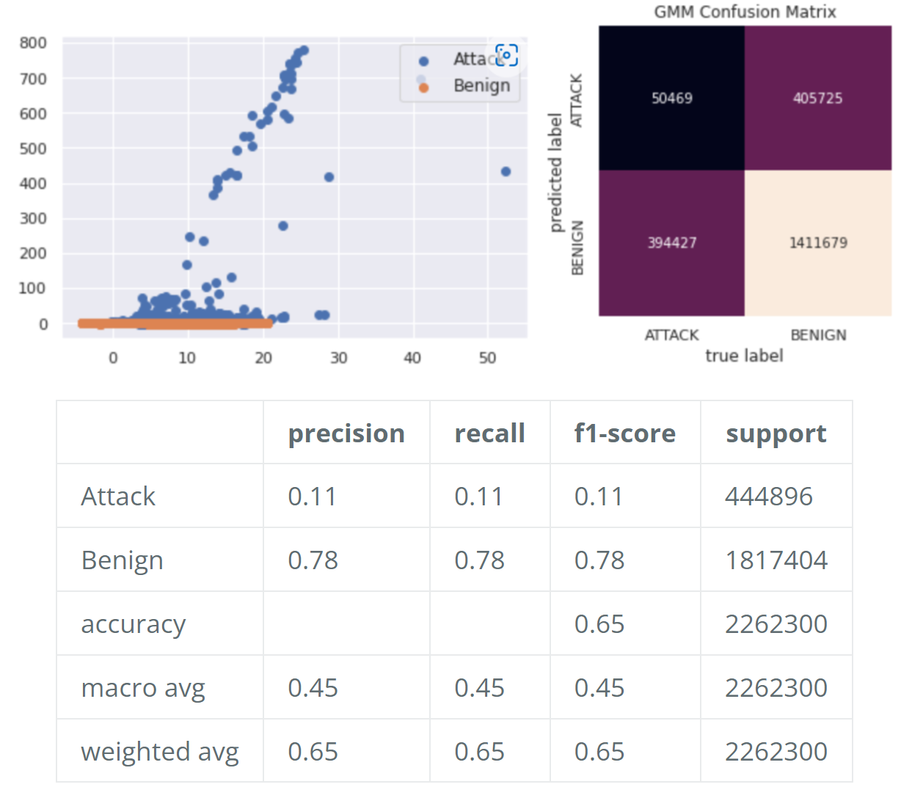
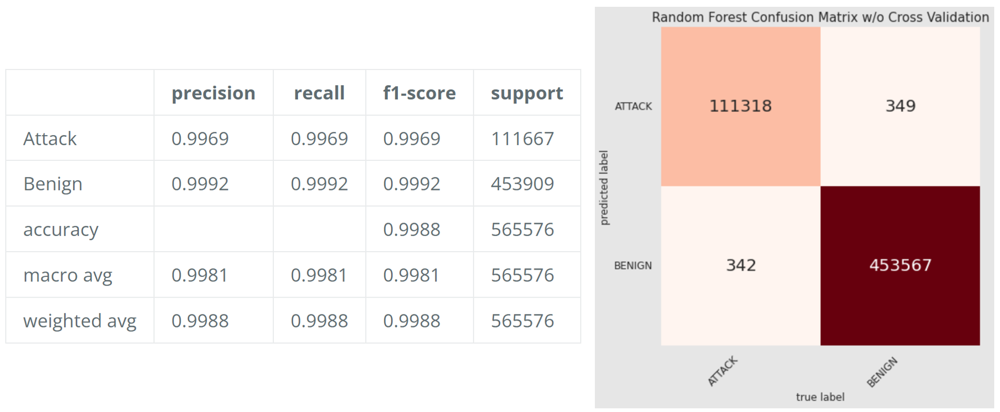
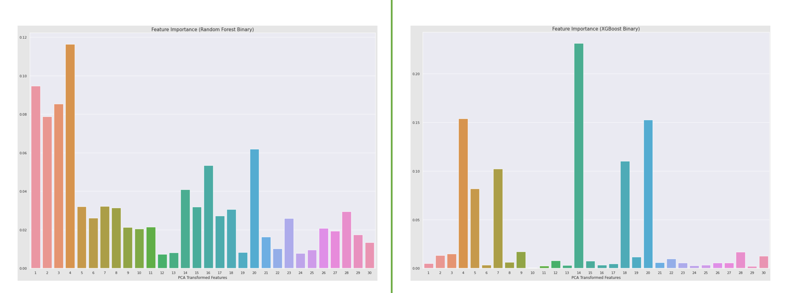
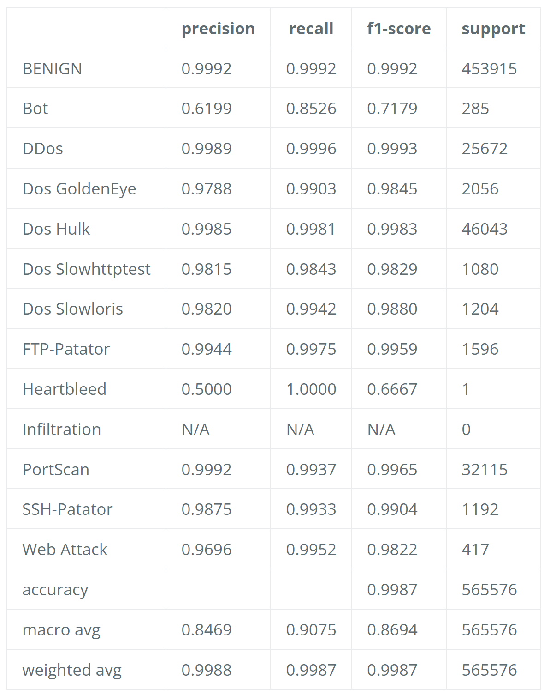
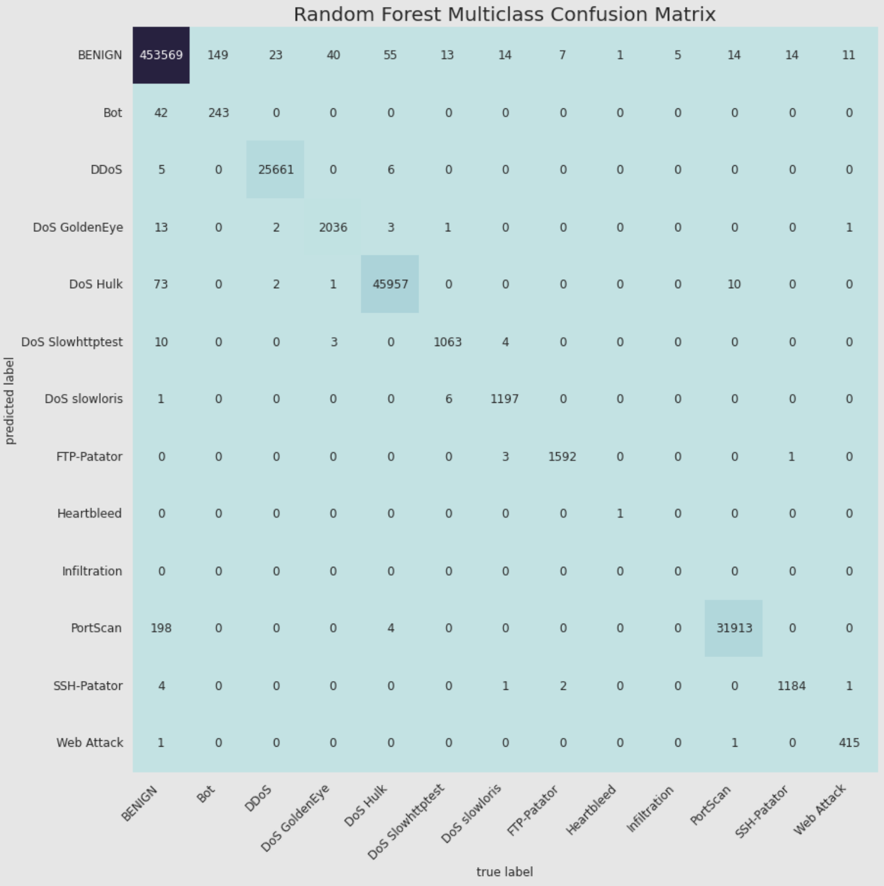
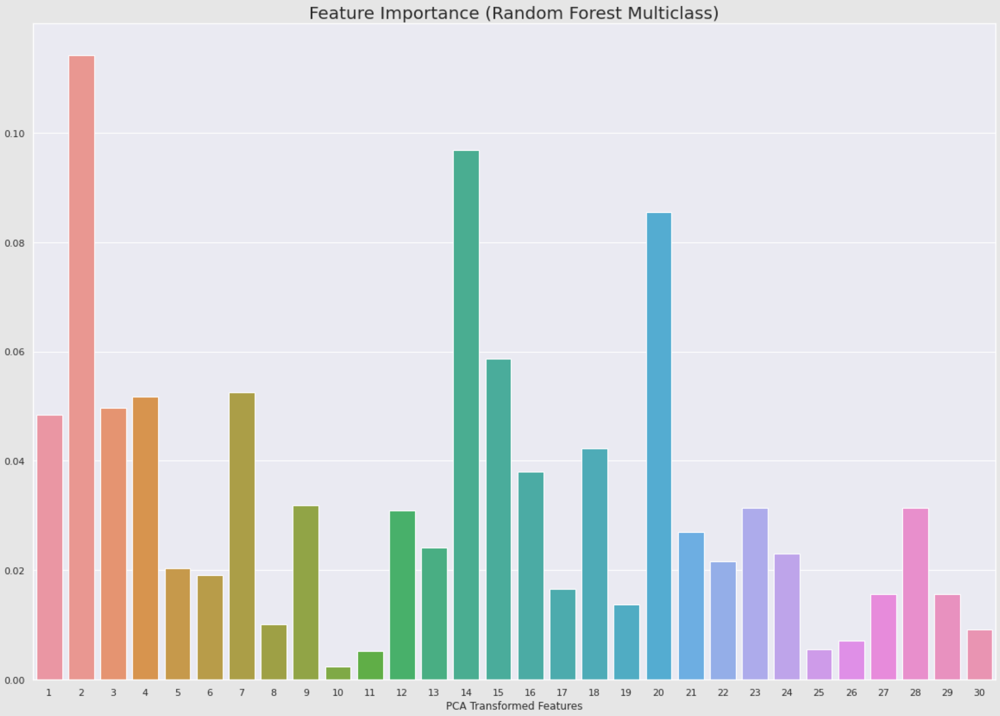

# Anomaly Network Traffic Detection

## Introduction/Background:
Due to nowadays' ever-growing network security concerns, an accurate and efficient way to distinguish normal activity flows from cyber attacks becomes exceedingly important. Our project will develop a trained machine in place of Intrusion Detection Systems (IDS) to monitor network traffic for suspicious activities. To decrease false alarms in IDS, we plan to investigate and contrast the influences of more than 80 features branched under some of the most common types of attacks – web-based, brute force, DoS (disk operating system), DDoS (distributed denial of service), infiltration, heart-bleed, bots, and portscan. Such a model would strengthen available defense tools against those sophisticated network attacks and alleviate burdens of website owners and administrators.

## Problem Definition:
We aim to build an IDS model to distinguish benign and potential anomaly network traffic. The goal is to minimize false positives while not permitting false negatives, or the most serious states of identifying malicious activity as acceptable.

## Dataset:
- [Intrusion Detection Evaluation Dataset (CIC-IDS2017)](https://www.unb.ca/cic/datasets/ids-2017.html)
- Labeled network flows, including full packet payloads in pcap format and CSV files for machine/deep learning purposes
- Covered ten criteria as a reliable dataset: complete network configuration, complete traffic, labeled dataset, complete interaction, complete capture, available protocols, attack diversity, heterogeneity, feature set, and MetaData
- Started at 9am on Monday, July 3, 2017 until 5pm on Friday July 7, 2017, for a total of 5 days

## Methods and Discussions:
### Data Cleaning
Clean data is foundational to any data-driven project, and it is important we pay close attention to how data is structured and populated. Sometimes, data is found to be duplicated, corrupted, present in different or invalid data types, structurally wrong, out of scale or even erroneous. Our goal is to combine 5-day worth of network traffic data (2,830,743 x 79) into X_train, y_train, X_test, and y_test dataframes which are free of invalid entries and binary-labeled as ‘BENIGN’ or ‘ATTACK’.
- **step 1**: Combining Mon-Fri Network Data 
The given dataset has each of the weekdays concentrated with different attack types, for example, Monday -- benign, Tuesday -- infiltration, Wednesday -- brute force, etc. However, we are only interested in generally detecting attacks from the benign data, so we vertically concatenate them all into a (2,830,743 x 79) matrix including 78 features and 1 label column.  
- **step 2**: Remove Entries Containing NaN and Infinity Values 
In order to remove invalid entries, we first convert infinity values (too enormous to be represented by float 64 type) into NaN. Then altogether remove data rows containing NaN or/and infinity entries using pd.dropna() function. This reduces the total row from 2,830,743 to 2,827,876 where the eliminated 2,867 rows consist of 1,777 benign data and 1,090 attack data. Despite a higher attack ratio of invalid entries (1/3) than that of the total population (1/5), we consider that data removal is appropriate here because 3,000 is only a tiny subset of nearly 3 million data.  
- **step 3**: Convert into a Binary Classification 
We replace all non-Benign labels with "Attack". These labels include Brute Force FTP, Brute Force SSH, DoS, Heartbleed, Web Attack, Infiltration, Botnet, and DDoS.  
- **step 4**: Split Training and Testing Data 
After cleaning the dataset, we randomly dedicate 80 % of the dataset as training data and the remaining 20 % as testing dataset.

### Feature Preprocessing – PCA
We choose PCA to reduce dimensions while maximizing variance and preserving strong patterns in our dataset. We also considered backward and forward selections, but those two are too computationally expensive for our datasize. Our goal is to identify the number of principal components that would explain around 95% of the variation in the data.   Since principal component analysis applies to unsupervised/unlabeled data, we first standardize and transform 78 features from X_train and X_test to z-space; then we select top 30 features to achieve approxiamtely 95% cumulative explained variance as indicated by the plot. This feature extraction is extremely important as unsupervised clustering methods are more accurate with orthogonalized z-space features. In addition, a reduction of 48 features removes extra computational complexity.  

### Unsupervised Methods
Since the dataset already provides corresponding labels, we plan to implement unsupervised methods merely to visualize the data points along with their neighboring distances and to compare with supervised methods.
- **KMeans**  
We start with K-Means, one of the easiest, NP-hard, and efficient heuristic clustering algorithms, because it converges quickly to a sufficiently good solution for most applications. The K-Means algorithm randomly selects k cluster centers, with which data points are assigned. Optimization essentially minimizes total Euclidean distance between points and centers. The process iterates until the k-mean vectors converge to a steady-state, which signifies linear decision boundaries for cluster assignments.   Since our dataset is rather non-linear, we do not expect good clustering results for our data. After applying K-Means algorithm with k=2 and other default sklearn parameters, the distance plot suggests nearly 2 million predicted-benign data fall within the small orange, bottom-left cluster while the rest 10% are sparsely distributed along domain and range. We don’t run an elbow plot to determine k-parameter because on the contrary, we can compare output cluster assignments (array of 0s and 1s) with our y_label (converted as Attack → 0, Benign → 1) when k=2 assuming the predominant prediction will match to benign data. Indeed, the resulting confusion matrix and classification report suggest K-Means performs slightly better than guessing all inputs as benign and deviates far from our goal because more true attacks are predicted as benign than attack (project priority is minimizing false negatives).  

- **Gaussian-Mixture Model**  
We then move onto GMM, hoping for a similar process but as a soft-assignment including full covariance matrix, the algorithm would provide a higher accuracy and f-1 score especially for attack clusters assignment. The resulting distance plot and confusion matrix prove the opposite.  
After the first failure, we increment n-components from 2 to 9 respectively, reasoning that clustering 8 different types of attacks together with a small n might have contributed to the poor result. However, attack clusters f-1 scores are approximately 0.1 for all 8 trials (attached below corresponds to n=2 only). The two final conclusions from GMM are: 1) benign data from our dataset clusters well together, but clustering algorithm is performing poorly on attack data; 2) running unsupervised methods on labeled data is truly non-ideal.  

### Supervised Method
Random Forest Classification is often praised for its accuracy and efficiency. Notably, random forest is faster on large datasets with more features than other supervised counterparts such as neural networks and support vector machines. Composed of many decision trees, random forest "bootstraps," or randomly samples, a certain number of rows and columns from the original dataset, fitting the decision tree model for each subset. Then random forest generates the result by majority voting the outputs of these decision tree classifiers. As a result, random forest is consistent in outperforming single decision trees for classification problems.

Due to the time/computation factor for cross validations, we decide to also implement extreme gradient boosting for comparison, or XGBoost, which trains gradient-boosted decision trees using random forest as a base model. This model is popular for its execution speed and performance, but XGBoost's training process is much more time-consuming. For that reason, we only implement XGBoost for binary classification between benign/attack, and not multiclass classification for each attack type. We also cannot run k-folds cross validation on XGBoost due to time/computation considerations.  

Attached above is our very first Random Forest run with n_estimators=20 and other default sklearn hyperparameters, producing nearly 1.00 f-1 scores on both attack and benign types. The given confusion matrix can demonstrate the promising result even better, mislabeling only 691 data out of 565,576 test data. From the midterm report feedback, we decide to look into cross validation of these inputs, especially post-pruning each decision tree.

### Cross Validation and Comparison with XGBoost
In order to achieve an even lower false negative rate and to optimize random forest algorithm hyperparameters, we implement RandomizedSearchCV and GridSearchCV with focuses on n-estimator, max depth, min samples leaf, and min samples split. The RandomizedSearchCV, using 3-folds, closes in on hyperparameter values from hundreds of combinations out of the parameter grids, while GridSearchCV allows us to further narrow down the hyperparameter to more optimal values.

The reason behind fine-tuning n-estimator, max depth, min samples leaf, and min samples split is that we believe reducing overfitting through post-pruning decision trees would effectively reduce the false negative rate, increasing their recall values. Indeed, cross validation gives us **{n_estimators=6, max_depth=42, min_samples_leaf=3, min_samples_split=10}** for a more optimal hyperparameter. The n-estimators reduce 20 decision trees down to 6; the deepest of the original 20 trees were limited from 55 to 42 layers; increase of numbers in min samples leaf and min samples split means stricter requirements to split a node. All these signify there is overfitting for our initial Random Forest run, and therefore, we further implement Random Forest and XGBoost with these values.  

For attacks that are identified as benign, we successfully decrease counts from 342 to 291; however, the other values and specifically XGBoost are simply performing similarly, not better or worse in the scale of 565,576 test data.  

We also plot these two models’ feature importance based on the 30-PCA orthogonalized features. These features are labeled as 1-30 because principal component analysis transformed original features to z-space; in addition, without hacking experience, we have no clue what the 78 features from the original dataset mean. The general trends from RF feature importance demonstrate relatively equivalent use of all pca features, while XGBoost only uses 6 features primarily. This indicates an ineffective implementation of XGBoost because 6 features only corresponds to 65-70% cumulative variance from PCA. The plots make sense since we have only fine-tuned RF’s hyperparameters and assumed these hyperparameters work equally well in XGBoost.

### Multiclass Random Forest Classification
Finally, we decide to turn our project into a supervised multiclass classification with Random Forest and cross validation, which works the best so far. Unsurprisingly, the validated hyperparameters are very similar to our previous run, **{n_estimators=7, max_depth=43, min_samples_leaf=3, min_samples_split=15}**.  

 

 

Once again, the algorithm yields a similar result because we have 346 important false negatives (149+23+40+...+14+14+11), where attacks that are mislabeled as other attacks are not concerning. The confusion matrix is more informative as we understand the majority of our false-negative comes from misidentifying Bot, Dos GoldenEye, and Dos Hulk attack types. All 30 features are relatively equally utilized, which signifies our model is very close to optimal. For possible future work, we would have to understand the characteristics of these three specific anomaly network traffics and implement corresponding fixes. 

## Concludions:
From unsupervised analyses, we understand that running unsupervised methods on labeled data is truly non-ideal; additionally, clustering algorithms are performing poorly on our nonlinear attack data. From supervised analyses, we reduce overfitting through cross validation, which can be seen by a huge reduction in training time elapsed; however, due to our 2,262,300 training data size, overfitting does not influence performance at all, resulting in similar supervised performance. Overall, all Random Forest and XGBoost algorithms perform exceedingly well, if we allow a small margin for false negatives. We conclude that in order to improve these models, we would have to first comprehend the specific traits of most misidentified attacks, which is not in the scope of this class, and second fine-tune XGBoost training hyperparameters, which is impossible timewise. Finally, the project also “trained” us in practical machine learning skills, including data cleaning, dimensionality reduction, visualizing data, and cross validation. 

## Proposed Timeline:
- Project Proposal:
  - Dataset, reference, and target problem (Yijie Gong, Wangzhuo Shi) - June 6th
  - Proposal first draft and review (Feng Gao, Heeyong Huang) - June 10th
  - 2-min presentation video (Zhenyu Chen) - June 13th
- Midterm Report
  - Dataset cleaning and feature selection (Yijie Gong) - June 22nd
  - Supervised and unsupervised methods implementation (Feng Gao, Wangzhuo Shi) - June 29th
  - Report first draft and model evaluation (Heeyong Huang, Zhenyu Chen) - July 4th
  - Mid-term report final draft (Team) - July 6th
- Final Report
  - Parameter, code, and model optimization (Feng Gao, Yijie Gong) - July 13th
  - Project final draft (Heeyong Huang, Wangzhuo Shi) - July 25th
  - Final team video (Team) - July 29th

## References:
- Sharafaldin, I., Habibi Lashkari, A., & Ghorbani, A. A. (2018). Toward Generating a New Intrusion Detection Dataset and Intrusion Traffic Characterization. In Proceedings of the 4th International Conference on Information Systems Security and Privacy. 4th International Conference on Information Systems Security and Privacy. SCITEPRESS - Science and Technology Publications. [https://doi.org/10.5220/0006639801080116](https://doi.org/10.5220/0006639801080116)
- Erman, J., Arlitt, M., & Mahanti, A. (2006). Traffic classification using clustering algorithms. In Proceedings of the 2006 SIGCOMM workshop on Mining network data - MineNet ’06. the 2006 SIGCOMM workshop. ACM Press. [https://doi.org/10.1145/1162678.1162679](https://doi.org/10.1145/1162678.1162679)
- Disha, R. A., & Waheed, S. (2022). Performance analysis of machine learning models for intrusion detection system using Gini Impurity-based Weighted Random Forest (GIWRF) feature selection technique. In Cybersecurity (Vol. 5, Issue 1). Springer Science and Business Media LLC. [https://doi.org/10.1186/s42400-021-00103-8](https://doi.org/10.1186/s42400-021-00103-8)
- Chitrakar, R., & Huang, C. (2012). Anomaly Based Intrusion Detection Using Hybrid Learning Approach of Combining k-Medoids Clustering and Naïve Bayes Classification. In 2012 8th International Conference on Wireless Communications, Networking and Mobile Computing. 2012 8th International Conference on Wireless Communications, Networking and Mobile Computing (WiCOM 2012). IEEE. [https://doi.org/10.1109/wicom.2012.6478433](https://doi.org/10.1109/wicom.2012.6478433)
